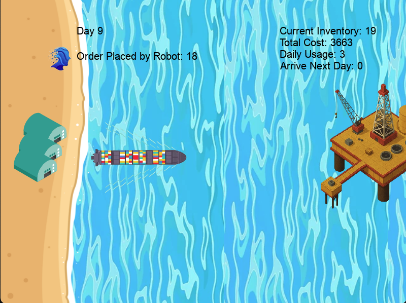

```markdown
# 🛢️ Oil & Gas Inventory Manager (RL Model vNO1.2)

This project simulates an oil and gas inventory management environment using reinforcement learning. A trained RL agent (model `NO1.2`) intelligently decides when to order resources based on inventory levels, shipping costs, and storage limits. The environment is visualized using Pygame for an engaging and educational interface.

## 🎯 Features

- Custom OpenAI Gym environment for oil & gas inventory control
- Real-time Pygame visualization of inventory and shipments
- Trained PPO agent using `Stable-Baselines3`
- Penalty/reward system for:
  - Ordering too early or too late
  - Overstocking
  - Emergency restocking
- Simple weekly and monthly cost reporting

## 📁 Project Structure

```

````

## 🚀 How to Run

1. **Install dependencies**

```bash
pip install stable-baselines3 pygame gymnasium numpy
````

2. **Ensure folder structure**

Place `NO1.2.zip` inside a folder named `Model/` and all images inside `lib/`.

3. **Run the simulation**

```bash
python OnG_manager.py
```

> The model `NO1.2` is automatically loaded and used for decision-making.

## 🧠 RL Agent: NO1.2

* Algorithm: PPO (Proximal Policy Optimization)
* Environment: `OilnGas`, a discrete-action inventory management simulation
* Reward design:

  * ✅ +5 for no order (cost-saving)
  * ❌ -25 for low inventory emergencies
  * ❌ -10 for overstocking
  * ✅ +10 for keeping weekly cost under budget

## 📷 Screenshots

| Gameplay                    | Info Panel                                              |
| --------------------------- | ------------------------------------------------------- |
|  *(example)* | Shows current inventory, daily usage, and cost tracking |

## 🔧 Notes

* This version uses a fixed trained model (`NO1.2`) and does not re-train unless `training = True` is manually set in `OnG_manager.py`.
* Environment resets after 30 simulated days.

## 📄 License

This project is open source and available under the MIT License.

---

*Created for educational and research use.*

```

---

Let me know if you'd like a shorter version or want to automatically generate GitHub topics and tags too.
```
